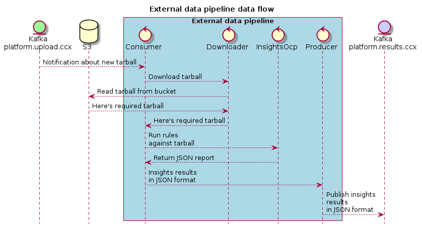

# Architecture

This service is built on top of [insights-ccx-messaging][2] and
[insights-core-messaging framework][1] and will be deployed and
run inside [cloud.redhat.com][3].

## External data pipeline diagram

## Sequence diagram

## Whole data flow

1. Event about new data from insights operator is consumed from Kafka. That event contains (among other things) URL to S3 Bucket
2. If processing duration is configured, the service tries to process (see next steps) the event under the given amount of seconds
3. Insights operator data is read from S3 Bucket and insights rules are applied to that data
4. Results (basically organization ID + cluster name + insights results JSON) are stored back into Kafka, but into different topic
5. That results are consumed by Insights rules aggregator service that caches them
6. The service provides such data via REST API to other tools, like OpenShift Cluster Manager web UI, OpenShift console, etc.

[1]: https://github.com/RedHatInsights/insights-core-messaging
[2]: https://github.com/RedHatInsights/insights-ccx-messaging/
[3]: https://cloud.redhat.com